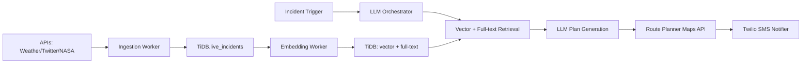

# AI Disaster Response Orchestrator

Intelligent multi-step disaster response coordination system using TiDB Serverless with vector search and LLM orchestration.

## Architecture



## Tech Stack

- **Frontend**: Next.js + Tailwind CSS (Vercel)
- **Backend**: Node.js + Express API Gateway
- **Workers**: Python ingestion & embedding workers
- **Database**: TiDB Serverless with vector + full-text search
- **Actions**: Google Maps API + Twilio SMS
- **Deployment**: Docker + GitHub Actions CI/CD

## Project Structure

```
ai-disaster-orchestrator/
├── packages/
│   ├── frontend/          # Next.js dashboard
│   ├── backend/           # Express API gateway
│   └── workers/           # Python ingestion & embedding
├── sql/                   # TiDB schema
├── .env.example          # Environment variables
├── docker-compose.yml    # Local development
└── README.md
```

## Quick Start

### Prerequisites
- Node.js 20+
- Python 3.11+
- Docker & Docker Compose
- TiDB Cloud account

### Setup

1. **Clone and install dependencies**:
```bash
git clone <your-repo>
cd ai-disaster-orchestrator
npm install
```

2. **Configure environment**:
```bash
cp .env.example .env
# Fill in your TiDB, OpenAI, Google Maps, and Twilio credentials
```

3. **Set up TiDB database**:
```bash
# Run the SQL schema in your TiDB Cloud instance
mysql -h <tidb-host> -u <user> -p < sql/create_tables.sql
```

4. **Start development servers**:
```bash
# Option 1: Use npm workspaces
npm run dev

# Option 2: Use Docker Compose
docker-compose up

# Option 3: Start individually
npm --workspace packages/frontend run dev    # Port 3000
npm --workspace packages/backend run dev     # Port 4000
cd packages/workers && python ingest_worker.py
```

### Environment Variables

Copy `.env.example` to `.env` and configure:

- **TiDB**: Connection details from TiDB Cloud
- **OpenAI**: API key for LLM orchestration
- **Google Maps**: API key for route generation
- **Twilio**: SID, token, and phone number for SMS

## Core Features

### Multi-Step Agent Workflow

1. **Ingest**: Pull alerts from OpenWeather, Twitter, NASA
2. **Embed**: Generate vector embeddings for text and images
3. **Retrieve**: Hybrid search (vector + full-text) for similar incidents
4. **Reason**: LLM generates structured action plans
5. **Act**: Create routes and send SMS notifications

### API Endpoints

- `POST /api/incidents/ingest` - Ingest new incident
- `GET /api/incidents/:id` - Get incident details
- `POST /api/incidents/:id/plan` - Generate response plan
- `POST /api/incidents/:id/route` - Generate evacuation routes
- `POST /api/incidents/:id/notify` - Send SMS notifications

## Day 1 — Completed ✅

- [x] Created TiDB Cloud account and noted DB connection info
- [x] Initialized monorepo with npm workspaces
- [x] Scaffolded frontend (Next.js), backend (Express), and workers (Python)
- [x] Created `.env.example` with required secrets
- [x] Added initial SQL schema `sql/create_tables.sql`
- [x] Added Docker/Docker Compose skeleton
- [x] Added CI skeleton with GitHub Actions
- [x] Created comprehensive README

## Day 2 — Completed ✅

- [x] **Enhanced Database Schema**: Complete TiDB schema with vector + full-text support
- [x] **Prisma Integration**: Type-safe database client with migrations
- [x] **Vector Search Ready**: `VECTOR(768)` columns with HNSW indexes for semantic search
- [x] **Full-Text Search**: MySQL `MATCH() AGAINST()` indexes on content fields
- [x] **Search API Endpoints**: `/api/search/*` with hybrid, geospatial, and keyword search
- [x] **Sample Data**: Test documents (weather alerts, protocols, social media)
- [x] **Validation Scripts**: Automated tests for schema and search functionality
- [x] **Idempotent Migrations**: Re-runnable SQL scripts for TiDB deployment

## Database Schema (Day 2)

### Core Tables

**`documents`** - Content with vector embeddings
- `id` (BIGINT AUTO_INCREMENT) - Primary key
- `content` (TEXT) - Raw document content  
- `embedding` (VECTOR(768)) - Text embedding for semantic search
- `category` (VARCHAR) - document type (protocol, report, social_media)
- `metadata` (JSON) - Structured fields (source, severity, location)
- Full-text index: `MATCH(content) AGAINST('query')`
- Vector index: `HNSW` for similarity search

**`alerts`** - Disaster alerts with geolocation
**`resources`** - Relief centers, hospitals, shelters with capacity tracking

### Search Capabilities

- **Full-Text**: `MATCH() AGAINST()` with relevance scoring
- **Vector**: Semantic similarity using HNSW indexes  
- **Hybrid**: Weighted combination (α=0.6 text + 0.4 vector)
- **Geospatial**: Distance-based resource discovery

### Validation

Run database tests:
```bash
cd packages/backend
npm run db:test
```

## Next Steps (Day 3+)

1. **Real-time Ingestion**: OpenWeather/Twitter/NASA API integration
2. **Embedding Generation**: OpenAI/local model pipeline
3. **LLM Orchestration**: Structured plan generation with JSON schema
4. **Actions**: Google Maps routing + Twilio SMS integration

## Development

### Running Tests
```bash
npm test                    # All tests
npm run lint               # Linting
```

### Database Migrations
```bash
# Apply schema changes to TiDB
mysql -h <tidb-host> -u <user> -p < sql/create_tables.sql
```

### Python Workers
```bash
cd packages/workers
python -m venv .venv
source .venv/bin/activate  # On Windows: .venv\Scripts\activate
pip install -r requirements.txt
python ingest_worker.py
python embedding_worker.py
```

## Contributing

1. Fork the repository
2. Create a feature branch
3. Make your changes
4. Add tests
5. Submit a pull request

## License

MIT License - see LICENSE file for details

## Demo

Coming soon: <4 minute demo video showing end-to-end disaster response workflow.

---

**Built for TiDB Hackathon 2025** - Showcasing TiDB Serverless vector search in a real-world multi-step agent application.
